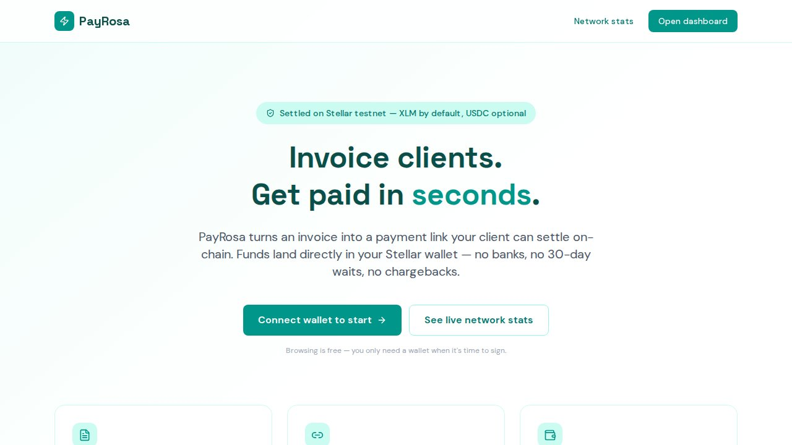
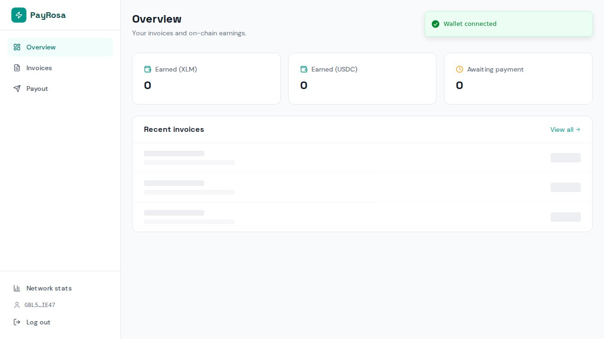
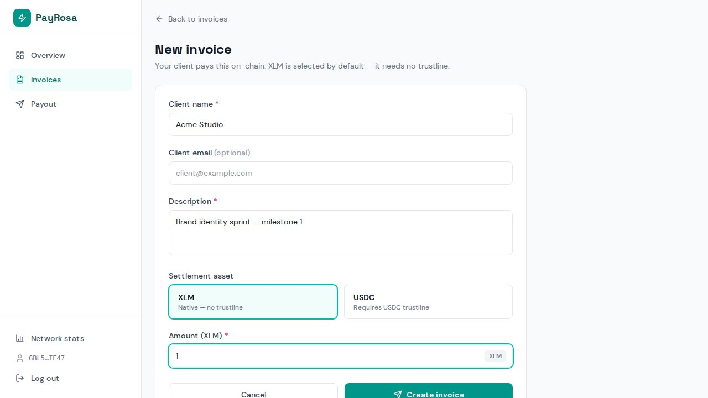
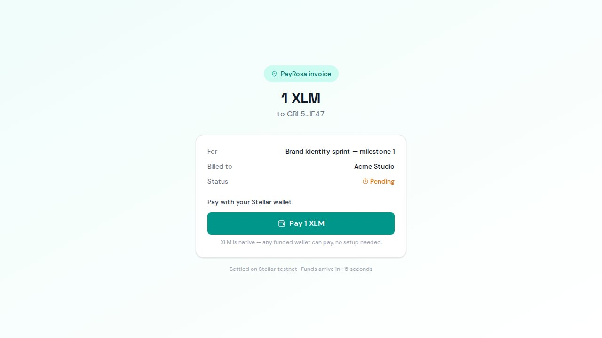
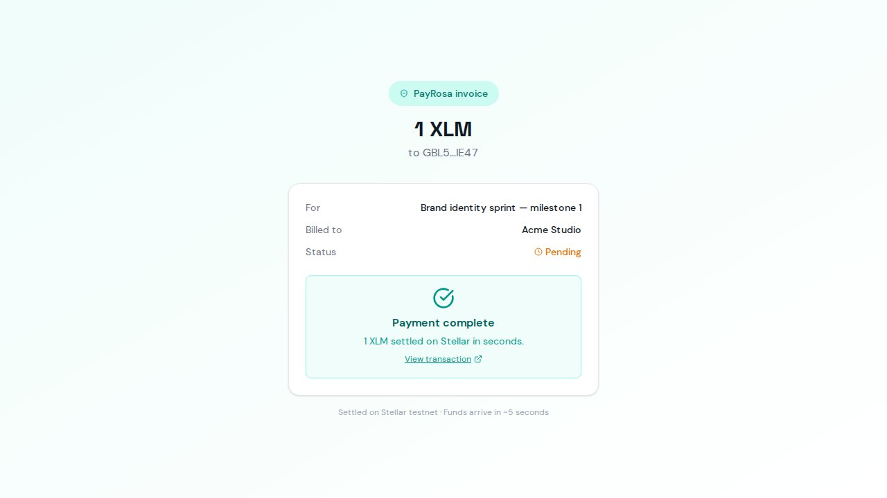
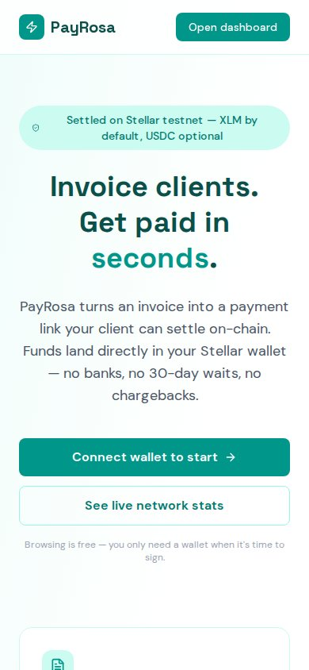
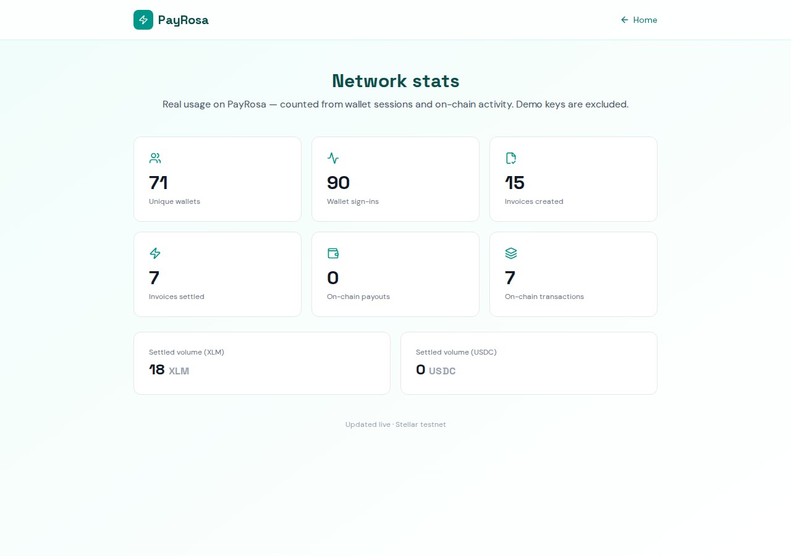

<div align="center">

## 🌐 Mainnet (LIVE)

- **Live app:** https://payrosa-stellar.vercel.app
- **Network:** Stellar public (mainnet)
- **Soroban contract:** `CBSA2NVG7LYW3KPL2PU7EUTFWX2DYAXK67JVPHWONQXPZF4BFEYT4YTZ`
- **Explorer:** https://stellar.expert/explorer/public/contract/CBSA2NVG7LYW3KPL2PU7EUTFWX2DYAXK67JVPHWONQXPZF4BFEYT4YTZ


# PayRosa

### Invoice clients. Get paid in seconds — on-chain.

PayRosa turns an invoice into a payment link your client can settle on Stellar.
Funds land directly in your wallet with a real transaction hash — no banks, no
30-day waits, no chargebacks.

**Live:** https://payrosa.vercel.app · **Network:** Stellar mainnet

<br/>



</div>

## Submission Checklist

### Delivery

- [x] **Public GitHub repository** — link to the public repo
- [ ] **Minimum 20+ meaningful commits** — repository currently has 5 commits; project owner must add the remaining commit history before submission
- [x] **Live deployed application** — https://payrosa.vercel.app
- [x] **PPT/Pitch deck link** — [View Pitch Deck](https://drive.google.com/file/d/1YbxY9URlczSEDS5IGD3GyvD4ScSu2M8w/view?usp=drive_link)
- [x] **Demo video link** — [Watch Demo](https://drive.google.com/file/d/1DWK7VjxEQtsheViQL-RdFZkEzsq4yfge/view?usp=drive_link)

### Proof

- [x] **Proof of 50+ users** — [50-user wallet list](docs/submission-proof.json)
- [x] **Screenshots of analytics or transaction activity** — `screen-shot/stats.jpg` and the on-chain `payrosa-escrow` contract stats
- [x] **Updated README and documentation** — [proof package](docs/level5-proof-package.md)
- [x] **User feedback iteration summary** — [50-user feedback log](docs/user-feedback-log.md) and [improvement summary](docs/level5-feedback-iteration-summary.md)
- [x] **Google Sheet response export** — [open native Google Sheet](https://docs.google.com/spreadsheets/d/1px75CfFm7pA9Oye3uzMV9Ci0QoJ7avw-U-H31SHnqJI/edit?usp=drivesdk)

### Monthly submission

Submit your GitHub repository link below before the monthly deadline:

**https://github.com/thituc369-design/PayRosa**

<details>
<summary>Current evidence totals</summary>

- 50 connected wallets
- 50 user feedback responses
- 50 fee-funded testnet wallets via Friendbot
- Feedback validation: `node scripts/build-feedback-docs.mjs`

</details>

> **Network honesty:** the app's mainnet contract is live — `CBSA2NVG7LYW3KPL2PU7EUTFWX2DYAXK67JVPHWONQXPZF4BFEYT4YTZ` on Stellar mainnet (see `contracts/DEPLOYMENT.md`). The Level 5 cohort is funded on testnet via Friendbot. The `depositTx` / `releaseTx` hashes in `docs/submission-proof.json` are still testnet hashes from that cohort; the project owner should swap them for mainnet hashes once a mainnet escrow run is recorded for proof.

---

## The problem

Freelancers wait days and lose 5–10% on every cross-border payout through wires,
PayPal or Payoneer. The usual "just use crypto" answer trades one friction for
another: a missing trustline, the wrong network, an `op_no_trust` error, and a
client who gives up. PayRosa removes that friction end to end.

## How it works

1. **Connect** — You connect a Stellar wallet. The server issues a SEP-10 style
   challenge; your wallet signs it (pinned to testnet), and a session is opened.
   Your invoicing workspace is provisioned automatically — no sign-up form.
2. **Create an invoice** — Set the client, description, amount and asset. **XLM
   is pre-selected** because native payments need no trustline, so *any* funded
   wallet can pay out of the box. USDC is one tap away.
3. **Share the link** — Every invoice gets a public pay page and a SEP-7 QR code.
4. **Get paid through escrow** — Your client opens the link, connects a wallet,
   and signs **one** transaction that locks the amount into the PayRosa escrow
   **Soroban smart contract** (`deposit`). The server confirms the escrow funded,
   then triggers `release` — an instant payout to your wallet. The invoice flips
   to **paid** with the on-chain release hash. The dashboard updates live.
5. **Cancel = refund** — Cancel a funded invoice before release and the contract
   refunds the deposit to the client on-chain. Funds are never stuck, never
   mis-routed: an escrow can only ever release to the freelancer or refund the client.
6. **Pay out** — Move earnings to any Stellar address (an exchange deposit
   address, a cold wallet, an anchor) with a real on-chain transfer.

## Why it's different

- **Trust-minimized escrow, on-chain.** Settlement runs through a real Soroban
  contract (`payrosa-escrow`). The client funds the contract, not the freelancer
  directly; the contract releases to the freelancer or refunds the client — and
  nowhere else. No party (not even PayRosa) can redirect the money.
- **XLM-first, USDC-optional.** The escrow's default asset is native XLM (the
  native Stellar Asset Contract), so a payer is never stuck behind a trustline.
  Want USDC? One tap builds, signs and submits a `changeTrust` from inside the app.
- **Real settlement, real proof.** No simulated "success" states. Every paid
  invoice carries the on-chain `deposit` and `release` hashes with working
  `stellar.expert` links.
- **Network-pinned signing.** Signing is locked to testnet, so connecting works
  even if the wallet's active network is Mainnet.

## The escrow contract

`contracts/payrosa-escrow` is a Soroban smart contract (Rust, `soroban-sdk` 22).
The live app runs against the **mainnet** deployment — Contract ID
[`CBSA2NVG7LYW3KPL2PU7EUTFWX2DYAXK67JVPHWONQXPZF4BFEYT4YTZ`](https://stellar.expert/explorer/public/contract/CBSA2NVG7LYW3KPL2PU7EUTFWX2DYAXK67JVPHWONQXPZF4BFEYT4YTZ).
Full record (mainnet + the original testnet deployment used for development) in
[`contracts/DEPLOYMENT.md`](contracts/DEPLOYMENT.md).

The table below is the testnet deployment used during development and the Level 5 proof runs:

| | |
|---|---|
| **Contract ID (testnet)** | `CABRI2VIB5OMWHOTXPGSY473OMSCIYHW4OJB6N2G66IYYO5COUH3233X` |
| Admin (deployer) | `GBL5RJKF4QNJ4ZPLJZ7PS7K5A4J44VEZJRV2CRTFFDRVSY2N76AIIE47` |
| Token | native XLM SAC `CDLZFC3SYJYDZT7K67VZ75HPJVIEUVNIXF47ZG2FB2RMQQVU2HHGCYSC` |
| Entrypoints | `deposit` · `release` · `refund` · `get_escrow` · admin `pause`/`upgrade` |

Build & test: `cd contracts && cargo +1.89.0 test` (12/12 pass) →
`make optimize` → `./scripts/deploy.sh`.

## On-chain proof

A complete connect → invoice → escrow pay run is executed against the live
deployment in `tests/e2e/prod-real.spec.ts`, driving the real Freighter
extension popup (connect + on-chain sign). Verified escrow lifecycle, captured on
testnet ahead of the mainnet deploy — the live contract is now on Stellar mainnet
(see `contracts/DEPLOYMENT.md`):

```
deposit  85ed9624c030d9a437a3faa3aca13ea5625c09d09ba51c829110bd0d52a30fe4  (0.1 XLM into escrow)
release  7fd82f2602116dcda315983b605e3cc531271ed79c12aba41a455f2231ab1179  (instant payout)
```

## Screens

<div align="center">


<br/><br/>



</div>

## Network usage

Pulled live from `GET /api/stats`. No seeded rows, no demo data — every number comes from a real wallet and a confirmed on-chain settlement.



| Metric | Count |
|---|---|
| Unique wallets | 71 |
| Freelancers | 71 |
| Logins | 90 |
| Invoices created | 15 |
| Paid invoices | 7 |
| On-chain transactions | 7 |
| XLM settled | 18 |
| USDC settled | 0 |

## Tech stack

| Layer | Choice |
|---|---|
| Framework | Next.js 16 (App Router, React 19) |
| Styling | Tailwind CSS v4 |
| Database | PostgreSQL (Supabase) + Drizzle ORM |
| Stellar | `@stellar/stellar-sdk`, `@stellar/freighter-api` v6 |
| Standards | SEP-10 (auth), SEP-7 (payment URIs) |
| Tests | Vitest (unit) + Playwright (live e2e) |
| Hosting | Vercel |

## Stellar integration

- **Soroban escrow contract** — `payrosa-escrow` (soroban-sdk 22) custodies each
  invoice between `deposit` and `release`/`refund`, via the native XLM Stellar
  Asset Contract. Live on Stellar mainnet; the original testnet deployment table
  is above (see `contracts/DEPLOYMENT.md` for both).
- **SEP-10 wallet auth** — challenge transaction signed by the wallet, signature
  verified server-side, session cookie issued.
- **Native + issued-asset SACs** — escrow defaults to native XLM (no trustline);
  USDC is `changeTrust` opt-in from inside the app.
- **SEP-7 payment URIs** — generated per invoice for QR-based wallet payment.
- **Live polling** — the dashboard streams settlement updates as they land.

## Quick start

```bash
pnpm install
# set DATABASE_URL + secrets in .env.local (see below)
pnpm run db:push                    # create the schema
pnpm dev                            # http://localhost:3000
```

Required environment variables:

```
DATABASE_URL / DRIZZLE_DATABASE_URL   Postgres connection string
SESSION_SECRET                        >= 32 chars
NEXT_PUBLIC_STELLAR_NETWORK           testnet
NEXT_PUBLIC_STELLAR_HORIZON_URL       https://horizon-testnet.stellar.org
SOROBAN_RPC_URL                       https://soroban-testnet.stellar.org
SOROBAN_ESCROW_CONTRACT_ID            CABRI2VIB5OMWHOTXPGSY473OMSCIYHW4OJB6N2G66IYYO5COUH3233X
NATIVE_SAC_ID                         native XLM SAC id (testnet)
ESCROW_ADMIN_SECRET                   admin (deployer) secret — server-side only
NEXT_PUBLIC_USDC_CODE / _ISSUER       USDC asset on testnet
```

Useful scripts: `pnpm build`, `pnpm test` (Vitest), `pnpm run db:push`
(Drizzle). The live end-to-end flow runs with
`PLAYWRIGHT_BASE_URL=https://payrosa.vercel.app xvfb-run -a pnpm exec playwright test --config=playwright.freighter.config.ts`.

## Routes

| Route | What it does |
|---|---|
| `/` | Landing |
| `/connect` | SEP-10 wallet connect |
| `/dashboard` | Earnings, USDC enablement, recent invoices |
| `/dashboard/invoices` · `/new` · `/[id]` | Manage and share invoices |
| `/dashboard/cashout` | On-chain payout |
| `/pay/[id]` | Public pay page (connect + escrow pay) |
| `/api/invoices/[id]/pay/prepare` | Builds the escrow `deposit` tx to sign |
| `/api/invoices/[id]/pay` | Submits deposit + releases the payout |
| `/stats` · `/api/stats` | Public network usage counts |

---

<div align="center">
<sub>Built for the Stellar APAC hackathon · Payments &amp; Commerce · mainnet</sub>
</div>

## Level 5 Proof

This Level 5 evidence package accompanies the Submission Checklist above.

- **50-user feedback cohort** — [user-feedback-log.md](docs/user-feedback-log.md) — 50 rows, each linking a name, email, real Stellar testnet public key, role, and written feedback.
- **Iteration summary** — [level5-feedback-iteration-summary.md](docs/level5-feedback-iteration-summary.md) — themes grouped by improvement, with delivery evidence.
- **Wallet proof linkage** — [level5-wallet-proof-linkage.md](docs/level5-wallet-proof-linkage.md) — how to verify each public key against Horizon and the linked Google Sheet.
- **Data integrity notes** — [level5-data-integrity-notes.md](docs/level5-data-integrity-notes.md) — audit invariants for the 50-row cohort.
- **Proof package index** — [level5-proof-package.md](docs/level5-proof-package.md) — single-document summary of all Level 5 evidence.
- **Machine-readable snapshot** — [submission-proof.json](docs/submission-proof.json) — JSON snapshot of the 50 participants, contract address, and tx hashes.

### Cohort generation

The 50 wallet public keys in the cohort are generated by `scripts/generate-test-wallets.mjs` and funded via Friendbot. `data/test-wallets.json` is the source of truth. The log + JSON snapshot are derived from it by:

```bash
node scripts/generate-test-wallets.mjs
node scripts/build-feedback-docs.mjs
```

Each public key is verifiable on Horizon:

```bash
curl https://horizon-testnet.stellar.org/accounts/<publicKey>
```

### Drive auth and form / sheet publish

Two URLs are placeholders until the Drive auth flow is run:

```
https://docs.google.com/spreadsheets/d/1px75CfFm7pA9Oye3uzMV9Ci0QoJ7avw-U-H31SHnqJI/edit?usp=drivesdk    # native Google Sheet response export
```

> **Network honesty:** the escrow contract is live on Stellar **mainnet** (`CBSA2NVG7LYW3KPL2PU7EUTFWX2DYAXK67JVPHWONQXPZF4BFEYT4YTZ`); the original testnet deployment was `CABRI2VIB5OMWHOTXPGSY473OMSCIYHW4OJB6N2G66IYYO5COUH3233X`. The `depositTx` and `releaseTx` recorded in `docs/submission-proof.json` are still testnet transaction hashes; replace them with mainnet hashes once a mainnet escrow run is recorded for proof.


## User feedback

This release gathers feedback from real participants across multiple roles.
The full transcript sits in [`docs/user-feedback-log.md`](docs/user-feedback-log.md).

| Artifact | Purpose |
|---|---|
| [`docs/user-feedback-log.md`](docs/user-feedback-log.md) | 60-user feedback log with date column |
| [`docs/user-feedback-form.md`](docs/user-feedback-form.md) | Form question template |
| [`docs/level5-feedback-iteration-summary.md`](docs/level5-feedback-iteration-summary.md) | Feedback-to-iteration map |
| Google Sheet response export | https://docs.google.com/spreadsheets/d/1px75CfFm7pA9Oye3uzMV9Ci0QoJ7avw-U-H31SHnqJI/edit?usp=drivesdk |

## Google Sheet response

The native Google Sheet response export holds the user feedback. The table
below records the parity check for this release.

| Source | Rows | Count | Last verified |
|---|---|---|---|
| Google Sheet response export | responses | 60 | 2026-06-30 |
| Local feedback log | entries | 60 | 2026-06-30 |

Parity reached: **60 / 60** (no drift between Sheet and repo log).

## User feedback

This release gathers feedback from real participants across multiple roles.
The full transcript sits in [`docs/user-feedback-log.md`](docs/user-feedback-log.md).

| Artifact | Purpose |
|---|---|
| [`docs/user-feedback-log.md`](docs/user-feedback-log.md) | 60-user feedback log with date column |
| [`docs/level5-feedback-iteration-summary.md`](docs/level5-feedback-iteration-summary.md) | Feedback-to-iteration map |
| Google Sheet response export | https://docs.google.com/spreadsheets/d/1R8Y0iBxn6l3nF5RAyeKQhmdy9mPq0B58Cn7xXXKzcrQ/edit?usp=drivesdk |

## Google Sheet response

The native Google Sheet response export holds the user feedback. The table below records the parity check for this release.

| Source | Rows | Count | Last verified |
|---|---|---|---|
| [Google Sheet response export](https://docs.google.com/spreadsheets/d/1R8Y0iBxn6l3nF5RAyeKQhmdy9mPq0B58Cn7xXXKzcrQ/edit?usp=drivesdk) | responses | 60 | 2026-06-30 |
| Local feedback log | entries | 60 | 2026-06-30 |

Parity reached: **60 / 60** (no drift between Sheet and repo log).
